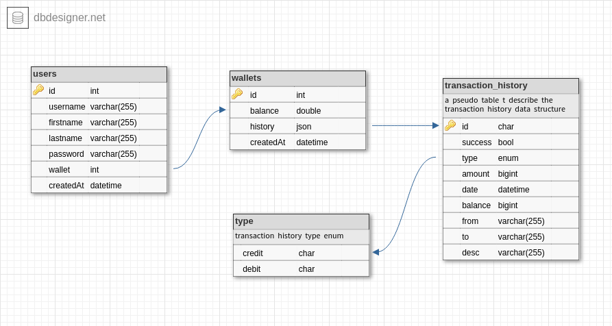

## Demo Credit API

  

  

<details  open="open">

:scroll: **Table of Contents**</summary>


<ul>

<li><a  href="#about">About</a></li>

<li>
<a  href="#installation">Installation</a>
</li>

<li><a  href="#technologies-used">Stack Used</a></li>
<li><a  href="#design-pattern">Design Pattern</a></li>
<li><a  href="#e-r-diagram">E-R Diagram</a></li>
<li><a  href="#contact">Contact</a></li>


</ul>

</li>


</ol>

</details>


---


### ABOUT

An API/Service developed to manage the users of demo-credit, a lending app, and their virtual wallets. 

 The API and documentation are accessible via the links below;

[API link](https://shehufatiudeen-lendsqr-be-test.herokuapp.com/)

[API documentation link](https://documenter.getpostman.com/view/18528397/2s83zjqN7Z)

---

### INSTALLATION

  

  

#### Use this option if you want to play around with the code on your local machine

  

1. Clone this repository and open your terminal/command line app in the root folder

2. Install dependencies

```npm install ```

3. Run tests using the command below

```npm run test```


4. Rename the example.env file to .env, add the respective values and Run the command below to start server

```npm start```

5. Rename the example.env file to .env.local, add the respective values and Run the command below to start server in developer mode (server will auto restart when changes are made)

```npm run dev```

---

  

  
  

### Technologies Used

  

The following are the major tools that have been utilized for developing this service.

  

*  [Typescript](https://www.typescriptlang.org)

  

*  [Nodejs](https://nodejs.org/en/)

  

*  [Express](https://expressjs.com)

  

*  [Knex.js](https://knexjs.org/)

*  [MySQL](https://mysql.com/)


*  [Jest](https://jestjs.io/)


  

*  [Supertest](https://www.npmjs.com/package/supertest)

  
  

*  [Postman](https://www.postman.com/)

---

### Design Pattern

The following are the notable designs that have were used for developing this service.

* <b>Repository pattern</b>
  <br>
  This is an abstraction over the knex.js orm to simplfy it into a reusable CRUD module.

* <b>Service Pattern (Experimental)</b>
  <br>
  The service pattern used in this project is a combination of the business logic and the object representaion of a database table. The purpose of this pattern is enforce code reusability and easy scalability by decoupling models and binding business logic to their respective models. This is the first time i'm using it in an actual project so it still needs a lot of work.

* <b>Controller Decorator (experimental)</b>
  <br>
  Using the experimental decorator feature in JavasScript/TypeScript to reduce excess reusable code, I abstracted each request handler to a single method. 

* <b>Optimization and Low-latency</b>
  <br>
  All the servers used in this development process are free tier, there is little to no knowledge about network, speed, network timeouts or other factors that may lead to high latency. Also, the expremental patterns are not yet optimized for low-latency.


---

### E-R Diagram




---

  <!-- CONTACT -->

## Contact

  

*   Shehu-Fatiudeen Oluwaseun Lawal 
*   [Mail](mailto:shehufatiudeen@gmail.com)
*   [LinkedIn](https://linkedin.com/in/fatiudeen/)
*   [Twitter](https://twitter.com/fatiudeen_)
*   [Whatsapp](https://wa.me/2348061316131)

:scroll: **END**